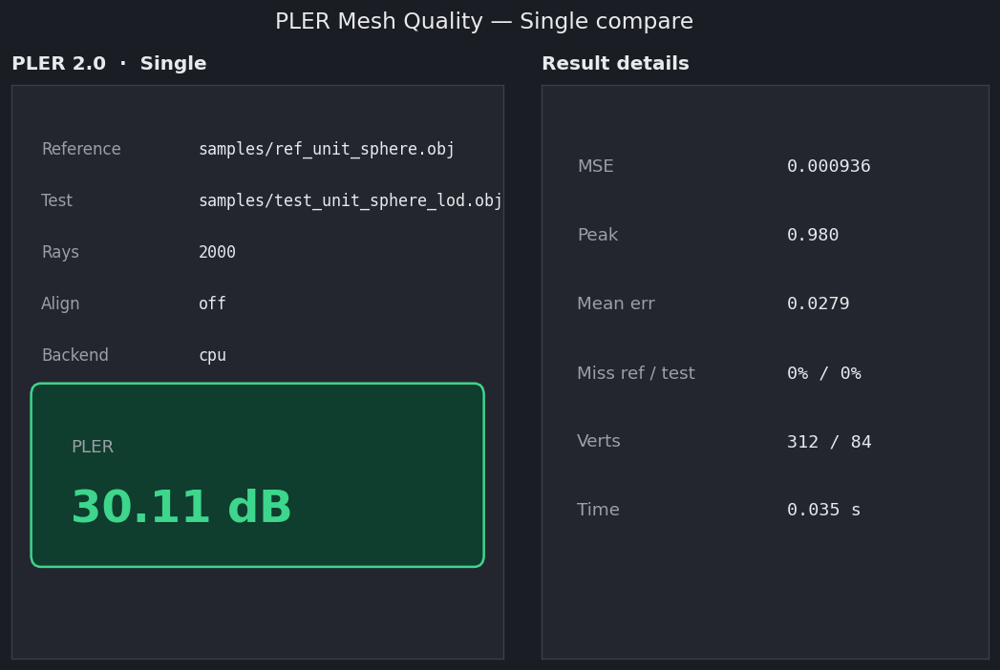
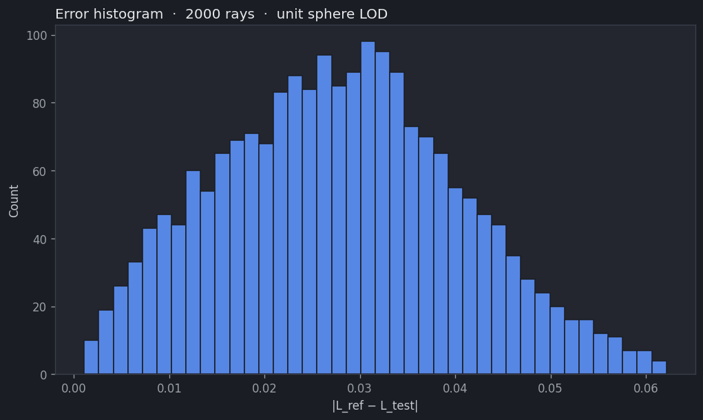
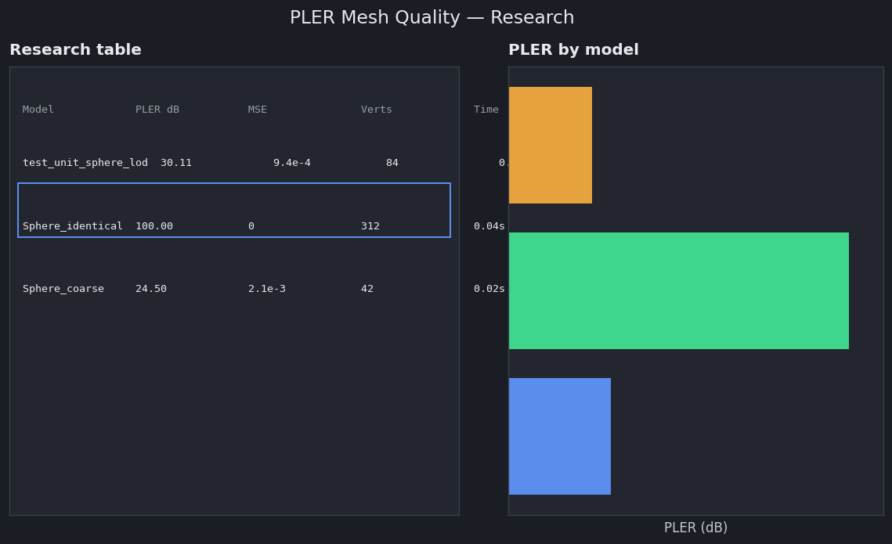

# PLER 2.0

Full-reference geometric fidelity metric for 3D assets (**Peak Length to Error Ratio**).

**License:** [MIT](LICENSE) · **Author:** Gleb Alekseevich Voronkov · **Contact:** glebvoronkov03@gmail.com

Native C++ engine · C ABI (`pler.dll` / `libpler.so` / `libpler.dylib`) · CLI · Dear ImGui GUI · optional CUDA (CPU is the reference path).

## Download

Binaries: **[Releases](https://github.com/GlebVoronkov03/PLER/releases/tag/v2.0.0)**

| Platform | Asset |
|----------|--------|
| **Windows** (x64) | `pler-2.0-win64.zip` |
| **Linux** (x64) | `pler-2.0-linux-x64.tar.gz` (CPU) · optional `pler-2.0-linux-x64-cuda.tar.gz` |
| **macOS** (Apple Silicon) | `pler-2.0-macos-arm64.zip` / `.dmg` (unsigned) |
| **macOS** (Intel) | `pler-2.0-macos-x64.zip` / `.dmg` (unsigned) |

**Windows**

```bat
pler --version
pler selftest
pler samples\ref_unit_sphere.obj samples\test_unit_sphere_lod.obj --rays 2000
pler gui
```

**Linux**

```bash
./bin/pler --version
./bin/pler selftest
./bin/pler samples/ref_unit_sphere.obj samples/test_unit_sphere_lod.obj --rays 2000
./bin/pler_gui
```

**macOS** (unsigned — clear quarantine if Gatekeeper blocks)

```bash
xattr -dr com.apple.quarantine .
./bin/pler --version
./bin/pler selftest
./bin/pler_gui
```

Windows and Linux CUDA packages may include the CUDA runtime. Without an NVIDIA GPU, PLER falls back to the CPU BVH. User guide: [docs/USER_GUIDE.md](docs/USER_GUIDE.md).

## pip / npm

```bash
pip install pler-metric
npm install pler-metric
```

**Python** (C ABI via ctypes):

```python
from pler_metric import options_init, compute_files, AlignMode

opt = options_init()
opt.num_rays = 2000
r = compute_files("ref.obj", "test.obj", opt)
print(r.pler_db, r.backend)
```

**Node** (N-API → `libpler`; natives downloaded on install from the Release):

```js
const pler = require("pler-metric");
const opt = pler.optionsInit();
opt.num_rays = 2000;
const r = pler.computeFiles("ref.obj", "test.obj", opt);
console.log(r.pler_db, r.backend);
```

Details: [bindings/python/README.md](bindings/python/README.md) · [bindings/node/README.md](bindings/node/README.md).

## Screenshots







## Blender

**PLER Mesh Quality** addon (Blender 3.6+ / 4.x): install [`pler-blender-2.0.zip`](https://github.com/GlebVoronkov03/PLER/releases/tag/v2.0.0) from the same Release. Bundles platform `pler` binaries; compare files or selected meshes, batch→CSV, Force CPU, error-sphere overlay. Details: [addons/blender/pler_metric/README.md](addons/blender/pler_metric/README.md).

## Build / embed

```bat
cd native
build.bat
```

Linux / macOS:

```bash
cd native
cmake -B build -DCMAKE_BUILD_TYPE=Release -DPLER_CUDA=OFF -DPLER_BUILD_GUI=ON
cmake --build build --target pler pler_shared pler_gui
./package.sh --os linux --arch x64   # or: --os macos --arch arm64|x64
```

Requires CMake ≥ 3.20 and a C++17 compiler. CUDA Toolkit with `nvcc` enables the GPU path; without it the build is CPU-only.

**C ABI** (shared library):

```c
#include "pler.h"
pler_options opt;
pler_options_init(&opt);
opt.num_rays = 2000;
pler_result out;
if (pler_compute_files("samples/ref_unit_sphere.obj",
                       "samples/test_unit_sphere_lod.obj", &opt, &out) == 0)
  printf("PLER = %.3f dB\n", out.pler_db);
```

**CMake FetchContent** (in-tree): see [Developer Guide — Integration](docs/DEVELOPER_GUIDE.md#integration). Advanced C++ API: `native/pler_core/include/pler/`.

| Audience | Document |
|----------|----------|
| Users | [docs/USER_GUIDE.md](docs/USER_GUIDE.md) |
| Developers | [docs/DEVELOPER_GUIDE.md](docs/DEVELOPER_GUIDE.md) |
| Contributing | [CONTRIBUTING.md](CONTRIBUTING.md) |
| Security | [SECURITY.md](SECURITY.md) |

## Score (PLER-2.0)

Shared sphere · inward Fibonacci rays · miss = R ·  
\(\mathrm{PLER} = 10\log_{10}((R-L_{\min})^2/\mathrm{MSE})\) (capped at 100 dB).

Optional alignment (`--align`) and topology (`--tsi`). Prefer **align off** when meshes are already co-registered.

## Citation

```bibtex
@inproceedings{voronkov2026pler,
  title     = {PLER: A Novel Full-Reference Metric for Evaluating the Geometric Fidelity of 3D Assets},
  author    = {Voronkov, Gleb Alekseevich},
  booktitle = {2026 Systems of Signals Generating and Processing in the Field of on Board Communications},
  year      = {2026},
  doi       = {10.1109/IEEECONF68869.2026.11461193}
}

@inproceedings{voronkov2025xr,
  title     = {Research of Methods for Modeling User Assessments of 3D Content for Extended Reality Systems},
  author    = {Voronkov, Gleb Alekseevich},
  booktitle = {2025 Systems of Signals Generating and Processing in the Field of on Board Communications},
  year      = {2025},
  doi       = {10.1109/IEEECONF64229.2025.10948103}
}
```

See also [CITATION.cff](CITATION.cff).
